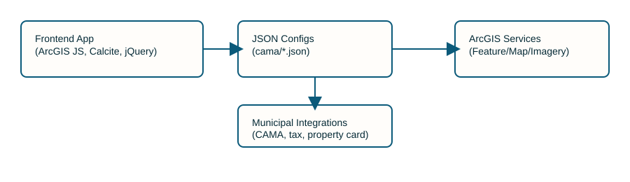

GIS Parcel Viewer
Overview

The GIS Parcel Viewer is a web-based mapping application built using the ArcGIS JavaScript API. It allows users to explore municipal parcel data, search properties, view ownership details, apply filters, measure distances/areas, and export maps.

The application supports multiple municipalities using a JSON configuration system. Each town has its own configuration file that defines:

Webmap used

GIS Parcel Viewer

Professional README

This repository contains a production-ready web-based GIS Parcel Viewer built on the ArcGIS JavaScript API. The viewer supports many municipalities via a JSON-driven configuration system so that one codebase can power multiple customized local viewers.
Built using:

ArcGIS JavaScript API

Calcite Web Components

jQuery

Custom JavaScript modules

Responsibilities include:

Rendering the map

Managing user interaction

Running parcel queries

Controlling UI components

2. ArcGIS Services

The application consumes data from:

ArcGIS Feature Services

ArcGIS Map Services

ArcGIS Imagery Services

ArcGIS WebMaps

Typical data layers include:

Parcel boundaries

Property assessment tables

Aerial imagery

Zoning

Neighborhood boundaries

3. JSON Configuration System

Each municipality has a JSON configuration file defining:

Webmap ID

Parcel layers

UI styling

External links

Filtering configuration

This allows a single codebase to support many municipalities.

4. Municipal Data Integrations

The viewer integrates with municipal systems including:

CAMA systems

Vision Government Solutions

Property record systems

Tax billing systems

These integrations are defined through configurable URL templates.

Initialization flow (simplified)

1. Read `?viewer=` URL parameter and fetch the municipality JSON from `cama/`.
2. Validate the configuration and resolve assets (logos, webmap ID, external links).
3. Initialize the ArcGIS WebMap (`webmapId`) and create a `MapView`.
4. Load parcel layers and populate dynamic filter lists.
5. Enable UI interactions (search, selection, printing, measurement).

Parcel layer models

- Standard: each parcel record stores its geometry.
- Condominium: units may be stored separately while sharing parcel geometry; the viewer toggles `condoLayer` / `noCondoLayer` when needed.

Parcel search & selection

Search by owner, street, parcel ID, or GIS link ID. Selecting a result queries the parcel geometry, highlights it on the map, zooms to the parcel, and opens the property card.

Filters

Text filters (street, owner, zoning), numeric range filters (value, acreage), and date-range filters (sale date). Dropdowns for categorical filters are populated from distinct values in the parcel table for accuracy.

Selection tools

Click selection, lasso (draw polygon), and buffer-based expansion. Selected parcels are highlighted and listed in the results panel for batch actions.

Measurement tools

Distance (feet) and area (acres). Parcel selection is temporarily disabled while measuring to avoid interaction conflicts.

Layer management

Layer List with visibility toggles, opacity sliders, grouped layers, and basemap switching. When imagery is enabled, parcel symbology adjusts to maintain contrast.

Printing

Supports the ArcGIS Print Widget (standard layouts) and a custom high-resolution export that inserts map images into a printable layout with title, logo, scale bar, and disclaimer.

Runtime layer loading

Users can add external Feature/Map/Imagery services via URL at runtime; layers are added dynamically to the map.

JSON configuration

Each municipality has a JSON file under `desktop/cama/` (and a matching copy under `mobile/cama/`) that defines map IDs, parcel layers, UI text, and integration URLs. Example: `plainvillect.json`. Both copies must exist and are kept in sync, since the desktop (`scripts.js`) and mobile (`mobile.js`) apps each load their own copy independently.

Required keys (minimum): `webmapId`, `masterTable`, `condoLayer`, `noCondoLayer`, `condos`, `title`, `tabTitle`, `parcelServiceTitle`, `scale`, `parcelZoom`.

Variable reference

Map, branding & performance:

| Key | Type | Purpose |
| --- | --- | --- |
| `webmapId` | string | ArcGIS WebMap portal item ID the viewer loads. Falls back to a default map ID if omitted. |
| `title` | string | Municipality name/title. |
| `tabTitle` | string | Browser tab title. |
| `basemapTitle` | string | Label shown for the basemap entry in the layer list. |
| `welcomeImage` / `image` | string (URL) | Municipal seal/logo shown in the header. |
| `imageUrl` | string (URL) | Base path for parcel building photos. |
| `scale` | number | Initial map scale on load. |
| `parcelZoom` | number | Zoom level used when zooming to a selected parcel. |

Parcel data & layers:

| Key | Type | Purpose |
| --- | --- | --- |
| `masterTable` | string (URL) | FeatureLayer REST endpoint for the parcel table used for search/query. |
| `condos` | "yes"/"no" | Which parcel layer loads by default — toggles between `condoLayer` and `noCondoLayer`. |
| `condoLayer` / `noCondoLayer` | string (URL) | FeatureLayer endpoints for condo vs. non-condo parcel geometry. |
| `parcelServiceTitle` | string | Title shown for the parcel layer in the layer list. |
| `parcelLayerRestTitle` | string | Descriptive REST service title (reference/documentation only — not currently read by the app code). |
| `parcelRenderer` | string (hex color) | Symbol color used for parcel boundaries. |
| `useUniqueIdforParcelMap` | "yes"/"no" | Whether the parcel/tax map PDF lookup uses the parcel's unique ID field. |
| `parcelMapUrl` | string | Base path used to build tax map / parcel map PDF links. |
| `includeFilter` | "yes"/"no" | Whether the attribute filter panel is shown. |
| `layers` | array | Extra layers used to build attribute filter dropdowns. Each entry: `url`, `title`, `fieldName`, `isVisible`, `orderByField`, `combobox1`, `combobox2`. |
| `customLegend` | "yes"/"no" | Whether a custom image-based legend is shown instead of the default. |
| `legendImages` | array (URLs) | Images displayed in the custom legend popup when `customLegend` is `"yes"`. |

Styling (reserved — present in config files but not yet wired into the UI):

| Key | Type | Purpose |
| --- | --- | --- |
| `cssHeaderBackground`, `cssViewBackground`, `cssLayerFilterColor`, `cssLayerFilterTextColor` | string (hex color) | Reserved for future per-municipality theming. |

Welcome message & disclaimer:

| Key | Type | Purpose |
| --- | --- | --- |
| `customWelcomePage` | "yes"/"no" | Whether to override the default welcome message. |
| `customWelcomeMessage` | string | Message shown when `customWelcomePage` is `"yes"`. |
| `showDisclaimer` | "yes"/"no" | Whether the disclaimer modal/overlay is shown at all. |
| `customDisclaimerPage` | "yes"/"no" | Whether to fully replace the default disclaimer text. |
| `customDisclaimerMessage` | string | Text shown when `customDisclaimerPage` is `"yes"`. |
| `showParcelUpdateDate` | boolean (`true`/`false`) | Whether the "Parcel boundaries updated on… / CAMA update nightly" line is appended to the bottom of the disclaimer. |
| `parcelUpdateDate` | string | Date shown in that line (common date format, e.g. `"01/01/2026"`), rendered in bold red. |

Property card, detail links & integrations:

| Key | Type | Purpose |
| --- | --- | --- |
| `DetailLinks` | array | Full set of possible detail-link types available for the property card popup. |
| `DetailLinksToInclude` | array | Subset of `DetailLinks` actually enabled for this municipality. |
| `accessorName` | string | Assessor's name/title displayed on the property card. |
| `propertyCard` | string (URL) | Base URL for the online property record card system. |
| `propertyCardPdf` | "yes"/"no" | Whether the property card links to a static PDF instead of the online system. |
| `pdf_Image` | string (URL) | Base path for building-photo PDFs. |
| `pdf_demographics` | string (URL) | Link to the town demographics PDF. |
| `housingUrl` | string (URL) | Link to the town housing PDF. |
| `taxMapUrl` | string (URL) | Base path for tax map PDFs. |
| `tax_bill` | string (URL) | Base URL for the online tax bill lookup. |
| `useVisionForTaxBillUrl` | "yes"/"no" | Whether the tax bill link uses the Vision Government Solutions URL format. |
| `helpUrl` | string (URL) | Link to the help documentation page. |
| `includePermitLink` | "yes"/"no" | Whether a permit-lookup link is shown. |
| `permitLink` | string (URL) | Permit lookup URL, required when `includePermitLink` is `"yes"`. |

Backend ArcGIS service requirements (for whoever builds/configures the services)

Everything above is about the per-town JSON config. This section is about the actual ArcGIS services those config keys point to — `masterTable`, `condoLayer`, `noCondoLayer` — and the field schema they need to expose for the desktop app (`desktop/scripts.js`) to work. This was compiled by tracing every `feature.attributes.*` field the app reads.

Which service needs what

- `masterTable` (loaded twice internally as `CondosTable`/`noCondosTable`) is queried as a plain attribute table — `returnGeometry: false` everywhere it's used. It powers the search-suggestions dropdown, the main results list's underlying attribute lookups, and the abutters mailing-list panel. It does not need geometry, but does need the full field list below.
- `condoLayer` / `noCondoLayer` (loaded as `CondosLayer`/`noCondosLayer`) are the spatial layers — used for click/lasso/buffer selection and for drawing parcel boundaries. They're queried with `returnGeometry: true` and need the **same field schema as `masterTable`**, not just geometry + `GIS_LINK`. The results list, details panel, and abutters highlight are all built directly from attributes returned by these layers.
- **`masterTable` and `condoLayer`/`noCondoLayer` must be kept in sync as the same underlying dataset** (one non-spatial, two spatial). The app constantly cross-references records between them by `GIS_LINK` (e.g. abutters: find intersecting parcels on `condoLayer`/`noCondoLayer`, then re-query `masterTable` with `GIS_LINK = 'x' OR GIS_LINK = 'y'...` to pull mailing info). If a `GIS_LINK` value exists on one service but not the other — or is formatted differently (leading zeros, string vs. number, extra whitespace) — that record will silently fail to join. This is the single most common cause of "it finds the parcel on the map but the details/list are empty" style bugs, abutters included.

Required field schema

All fields are read as strings unless noted. Field names are case-sensitive in the queries the app builds (e.g. `GIS_LINK = '...'`), so they must match exactly.

| Field | Used for |
| --- | --- |
| `OBJECTID` | Standard Esri field; used as the row identifier for selection/click handling. |
| `GIS_LINK` | **Primary join key** between `masterTable` and `condoLayer`/`noCondoLayer`. Used everywhere: search, selection, abutters, exports. Must be present and value-identical on all three services. |
| `Uniqueid` | Secondary identifier; used for tax bill/property card/permit link URLs when `useUniqueIdforParcelMap`/`useVisionForTaxBillUrl` are `"yes"`, and as an alternate join key when `GIS_LINK` isn't usable (e.g. no-geometry condo records). |
| `Owner` | Search, results list, details, abutters/mailing list, print labels. A value of exactly `"RESIDENT"` (or blank) causes the app to hide that parcel from normal search results (privacy convention) — it still appears via click-select, lasso, or abutters. |
| `Co_Owner` | Search, results list, details, abutters/mailing list. |
| `Location` | Search (street address); shown in results/details. |
| `Street_Name` | Search only (separate from `Location` so users can search by street without a house number). |
| `MBL` | Search, results list, details (Map-Block-Lot parcel number). |
| `Mailing_Address_1`, `Mailing_Address_2`, `Mailing_City`, `Mail_State`, `Mailing_Zip` | Abutters mailing-list panel, details panel, print labels. |
| `Parcel_Type` | Shown in results list; `"Condominium"` is checked specifically to route condo records correctly during click/URL selection. |
| `Parcel_Primary_Use`, `Building_Use_Code`, `Building_Type`, `Design_Type`, `Zoning`, `Neighborhood` | Details panel. |
| `Total_Acres` | Details panel, and available as a numeric range filter (`layers` config entries can point at it). |
| `Land_Type`, `Land_Type_Rate`, `Influence_Type`, `Influence_Factor`, `Functional_Obs`, `External_Obs` | Details panel (assessment breakdown). |
| `Assessed_Total`, `Appraised_Total`, `Prior_Assessed_Total`, `Prior_Appraised_Total`, `Prior_Assessment_Year` | Details panel; also usable as numeric range filters. |
| `Sale_Date`, `Sale_Price`, `Vol_Page` | Details panel; `Sale_Date`/`Sale_Price` also usable as range filters. |
| `Image_Path` | Suffix appended to a town's `imageUrl` config value to build each parcel's building-photo URL. |
| `AcctNum` | Used as the tax-bill lookup ID when `useVisionForTaxBillUrl` is `"yes"`. |
| `Map` | PDF map reference shown in details. |
| `Lat`, `Lon` | Shown in details; not used for map placement (that comes from geometry). |
| `Match_Status` | Optional, but if present a value of exactly `"MISMATCH"` (combined with `Building_Type === "Condominium"`) changes which layer a URL-based unique-ID search is routed to. Only needs to be populated if the town actually has condo/parcel record mismatches to flag. |
| `ACCOUNT_TYPE` | Note the field name is fully uppercase in the service — the app reads it as `attributes["ACCOUNT_TYPE"]` specifically, not `Account_Type`. |

Troubleshooting by symptom

- **Abutters search draws the buffer and highlights parcels on the map, but the mailing-list panel is empty or missing entries.** `condoLayer`/`noCondoLayer` returned geometry + `GIS_LINK` for the intersecting parcels, but the follow-up `GIS_LINK = '...'` query against `masterTable` found no matching rows. Check that `GIS_LINK` exists on `masterTable`, and that its values match `condoLayer`/`noCondoLayer` exactly (same type, formatting, no extra whitespace/leading zeros).
- **A parcel shows up in results but its "Zoom" button doesn't work, or clicking it does nothing.** Missing or null `GIS_LINK`/`Uniqueid`/`OBJECTID` on that record, or a geometry-less condo record where `Uniqueid` doesn't resolve back to a parcel on `condoLayer`/`noCondoLayer`.
- **Search returns fewer results than expected, or a known parcel never appears.** Check whether `Owner` is blank or literally `"RESIDENT"` on that record — those are filtered out of normal text search by design (they still work via lasso/click/abutters).
- **Tax bill / property card / permit links 404 or point at the wrong record.** Confirm `Uniqueid` (or `AcctNum`, when `useVisionForTaxBillUrl` is `"yes"`) is populated and matches what the target system (Vision, propertyrecordcards.com, mytaxbill.org, etc.) expects.
- **Numeric range filters (value, acreage, sale date/price) show no min/max or behave oddly.** The relevant field (`Assessed_Total`, `Appraised_Total`, `Total_Acres`, `Sale_Date`, `Sale_Price`) is missing, null, or non-numeric/non-date on some records — the app takes `Math.min`/`Math.max` across whatever values come back.

Adding a new municipality

1. Create `desktop/cama/newtownct.json` and a matching `mobile/cama/newtownct.json` with the required keys (and any of the optional keys above that apply).
2. Add the config name to the application's config whitelist if applicable.
3. Test locally: `http://localhost:8000?viewer=cama/newtownct`.
Deployment

The viewer is static and suitable for hosting on AWS S3, Nginx, Apache, or IIS. Ensure ArcGIS JS API access and appropriate licenses for data/services.

Dependencies: ArcGIS JavaScript API and the per-municipality JSON files in `cama/`.

Future improvements

- Modularize into ES modules
- Migrate UI to a modern framework (React/Svelte)
- Add server-side search and caching for large datasets
- Improve mobile UX and add analytics

---

Architecture
------------
Below are two illustrated diagrams summarizing initialization flow and component relationships. These are included as inline images; replace the images with updated exports if you update the diagrams.

Initialization flow:

Component diagram:

If you'd like, I can also:

- Commit this README replacement to the repo
- Export the diagrams as alternative formats (PNG/PDF)
- Convert this into a formal user guide with screenshots

Tell me which option you'd like next.