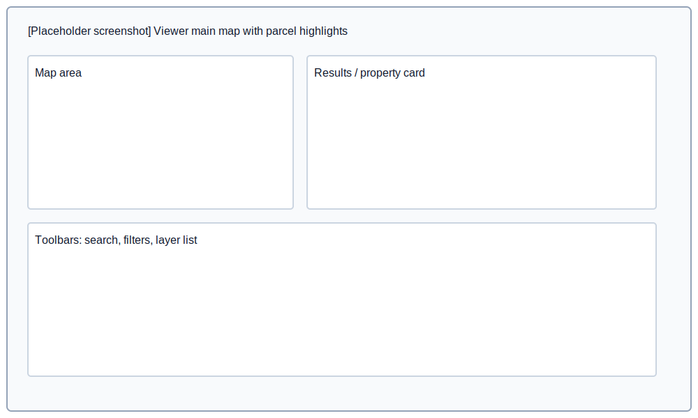

USER GUIDE — GIS Parcel Viewer

# Overview

This short guide demonstrates common workflows in the GIS Parcel Viewer and provides recommended screenshot locations for documentation or release notes.

## 1) Launching a viewer

You can run a local static server or use the VS Code Live Server extension. Example using Python's simple server:

```bash
python3 -m http.server 8000
```

Open: `http://localhost:8000?viewer=cama/canaanct`

## 2) Using VS Code Live Server (recommended)

Steps:

- Install the extension "Live Server (Ritwick Dey)" from the Extensions view.
- Open the workspace in VS Code and open `index.html`.
- Click "Go Live" in the status bar or right-click `index.html` → "Open with Live Server".

By default Live Server uses port `5501` for this workspace. To pin a different port, edit the workspace settings file `.vscode/settings.json`.

Example workspace setting (this project uses port 5501):

```json
{
	"liveServer.settings.port": 5501
}
```

After clicking Go Live, Live Server will open a URL like `http://127.0.0.1:5501` or `http://localhost:5501`. To stop the server click the status-bar "Port: 5501" / "Stop Live Server" button.

> Note: I previously suggested using port 3001; ignore that if you're already using port 5501.

## 3) Searching for a parcel

- Use the search box to find by owner, street, or parcel ID.
- Select a result to zoom, highlight, and open the property card.

## 4) Filters and selections

- Apply text filters (street, owner, zoning) or numeric ranges.
- Use the draw (lasso) tool for polygon selection or buffer the selection for nearby parcels.

## 5) Layer management

- Toggle layer visibility and adjust opacity from the Layer List.
- Switch basemaps from the Basemap selector.

## Screenshots (placeholders)

- Overview (map + tools):



- Initialization flow / settings: See `images/diagrams/initialization_flow.svg`

- Component diagram: See `images/diagrams/component_diagram.svg`

## How to capture screenshots

- macOS: `Cmd+Shift+4` and select an area, then save into `images/guides/`.
- Automated: use `puppeteer` to render and snapshot a local page (example below).

```bash
npx -y puppeteer --eval "(async()=>{const p=require('puppeteer');const b=await p.launch();const s=await b.newPage();await s.goto('http://localhost:5501?viewer=cama/canaanct');await s.screenshot({path:'images/guides/screenshot_live.png',fullPage:true});await b.close();})();"
```

## Notes

- Replace placeholder images with real screenshots before publishing user docs.
- Keep sensitive data out of screenshots (redact owner names if required).
